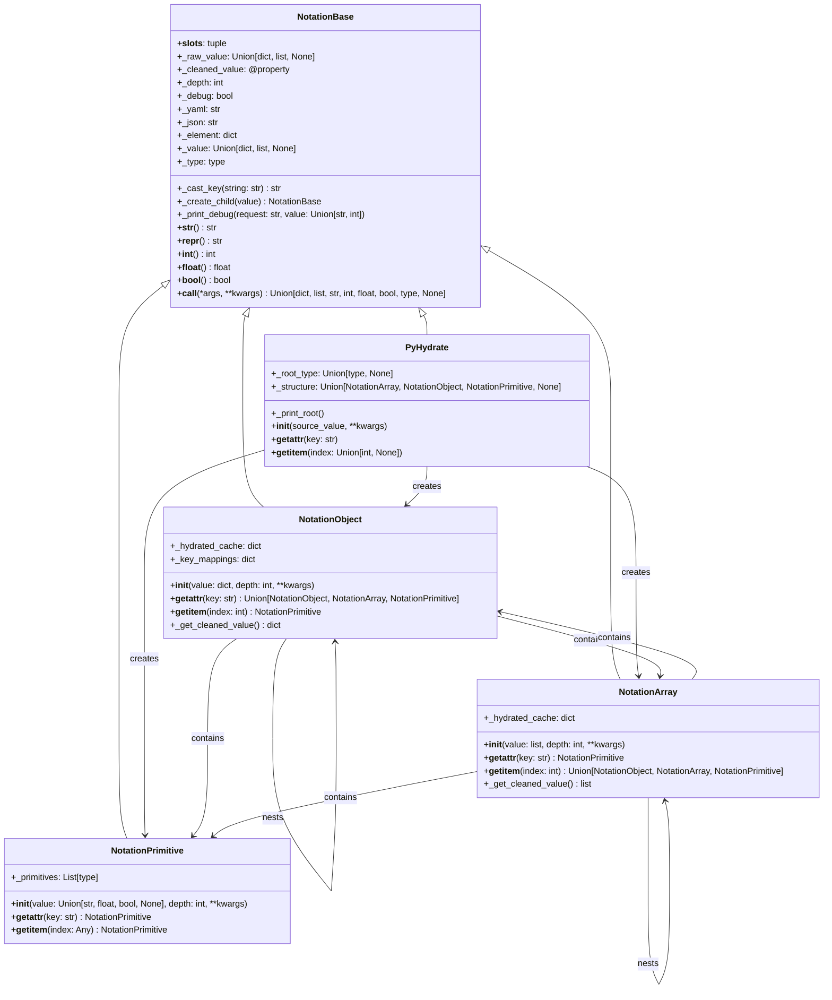
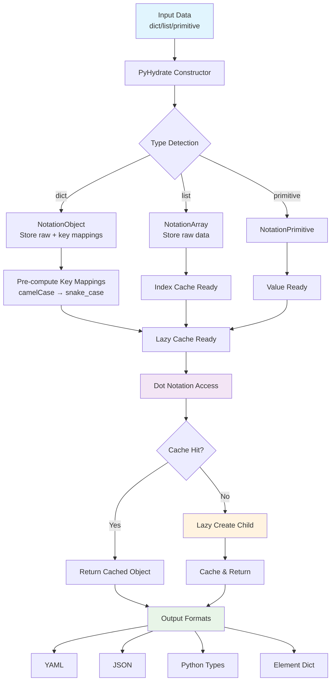
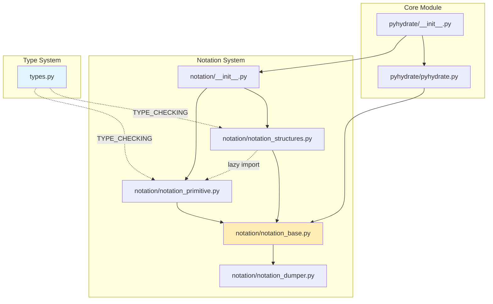

# Contributing to PyHydrate

Thank you for your interest in contributing to PyHydrate! This document provides guidelines for setting up a development environment and contributing to the project.

## Development Environment Setup

### Prerequisites
- Python 3.8 or higher
- Git

### Setting Up Your Development Environment

1. **Clone the repository**
   ```bash
   git clone https://github.com/mjfii/pyhydrate.git
   cd pyhydrate
   ```

2. **Create a virtual environment**
   ```bash
   python -m venv .venv
   source .venv/bin/activate  # Unix/macOS
   # or .venv\Scripts\activate  # Windows
   ```

3. **Install dependencies**
   ```bash
   pip install -r requirements.txt
   pip install -e .  # Install in development mode
   ```

## Development Commands

### Testing

Run all tests (recommended approach):
```bash
python -m unittest discover -s tests/ -p "*_tests.py"
```

Run individual test files (if needed):
```bash
python -m unittest tests/dict_get_tests.py
python -m unittest tests/list_get_tests.py  
python -m unittest tests/call_tests.py
python -m unittest tests/primitive_get_tests.py
python -m unittest tests/none_serialization_tests.py
python -m unittest tests/magic_methods_tests.py
python -m unittest tests/memory_efficiency_tests.py
python -m unittest tests/initialization_tests.py
python -m unittest tests/error_handling_tests.py
```

Run tests with verbose output:
```bash
python -m unittest discover -s tests/ -p "*_tests.py" -v
```

Run specific test class or method:
```bash
python -m unittest tests.call_tests.CallMethods.test_yaml_string
python -m unittest tests.error_handling_tests.TestErrorHandling
```

### Code Quality

Check code style and quality:
```bash
# Linting (identify issues)
ruff check pyhydrate/ tests/

# Auto-fix issues (safe fixes only)
ruff check pyhydrate/ tests/ --fix

# Auto-fix with unsafe fixes (be careful)
ruff check pyhydrate/ tests/ --fix --unsafe-fixes

# Code formatting
ruff format pyhydrate/ tests/

# Check formatting without making changes
ruff format --check pyhydrate/ tests/

# Get linting statistics
ruff check pyhydrate/ tests/ --statistics
```

### Building and Installation

Build the package:
```bash
pip install build
python -m build
```

### Running Examples

Execute the main demo:
```bash
python main.py
```

## Project Architecture

PyHydrate is a Python library that enables dot notation access to nested data structures (dicts, lists, JSON, YAML, TOML) with graceful error handling and automatic key normalization.

### Architectural Principles

**Simplified Inheritance Hierarchy:**
- Single inheritance chain: `PyHydrate` → `NotationBase`
- All notation classes inherit directly from `NotationBase`
- No circular inheritance or complex dependency chains

**Dependency Management:**
- Lazy imports to prevent circular dependencies
- TYPE_CHECKING guards for type hints
- Centralized type definitions in `pyhydrate/types.py`
- Forward references using string literals

**Clean Separation of Concerns:**
- `NotationBase`: Core functionality (magic methods, output formatting, key normalization)
- `NotationObject`: Dictionary/object handling with lazy loading
- `NotationArray`: List/array handling with lazy loading  
- `NotationPrimitive`: Primitive value handling
- `PyHydrate`: Main entry point and orchestration

**Memory Efficiency Architecture:**
- Lazy loading for all nested structures (`NotationObject` and `NotationArray`)
- Memory-optimized `__slots__` in all notation classes
- On-demand computation of cleaned values via `@property`
- Smart caching with pre-computed key mappings
- Factory pattern for child object creation

### Core Components

**Main Entry Point:**
- `pyhydrate/pyhydrate.py` - The `PyHydrate` class that serves as the main entry point, inheriting directly from `NotationBase`

**Notation System Architecture:**
- `pyhydrate/notation/notation_base.py` - Unified base class providing all shared functionality including debug printing, key casting (camelCase/kebab-case to snake_case), common magic methods, and representation formatting
- `pyhydrate/notation/notation_primitive.py` - Handles primitive values (str, int, float, bool, None)
- `pyhydrate/notation/notation_structures.py` - Contains `NotationObject` (dict wrapper) and `NotationArray` (list wrapper) classes
- `pyhydrate/notation/notation_dumper.py` - Custom YAML dumper for consistent output formatting
- `pyhydrate/types.py` - Centralized type definitions to avoid circular import dependencies

**Error Handling System:**
- `pyhydrate/exceptions/` - Custom warning classes following one-class-per-module standard
  - `pyhydrate_warning.py` - Base warning class for all PyHydrate operations
  - `type_conversion_warning.py` - Warnings for type conversion issues
  - `access_pattern_warning.py` - Warnings for invalid access attempts
  - `api_usage_warning.py` - Warnings for incorrect API usage
  - `format_warning_message.py` - Standardized warning message formatting utility
- `pyhydrate/error_handling.py` - Centralized error handling utilities and logging setup

### Key Features

**Automatic Data Type Detection:**
- JSON/YAML/TOML string parsing in constructor
- Parsing order: JSON → TOML → YAML for string inputs
- Recursive wrapping of nested structures
- Type-specific handling for primitives vs structures

**Key Normalization:**
- Converts camelCase, PascalCase, kebab-case, and "spaced keys" to snake_case
- Uses regex pattern matching for consistent key transformation
- Maintains mapping between original and cleaned keys

**Dot Notation Access:**
- `__getattr__` enables `obj.key` access
- `__getitem__` enables `obj[index]` access for arrays
- Graceful handling of missing keys/indices (returns None-type primitive)

**Output Formats:**
- Call with no args or 'value': returns cleaned value
- Call with 'element': returns `{type: value}` dict
- Call with 'type': returns Python type
- Call with 'json'/'yaml'/'toml': returns formatted string
- Call with 'depth': returns recursion depth
- Call with 'map': returns key mapping (when implemented)

**Standardized Error Handling:**
- Custom warning classes for different error types (type conversion, access patterns, API usage)
- Consistent warning message formatting with suggestions for fixing issues
- Structured logging system with configurable debug levels
- Graceful error handling with informative warnings instead of crashes
- Users can filter warnings by specific types for better error management

**Debug Mode:**
- Pass `debug=True` to constructor for detailed traversal logging
- Shows recursion depth, operation type, and value access
- Structured logging replaces print statements for better control

### Data Flow (Lazy Loading Architecture)

1. Input → `PyHydrate` constructor detects type (dict/list/primitive)
2. Raw value stored → Key mappings pre-computed (snake_case normalization)
3. **Lazy hydration**: Child objects created only on first access
4. Access via dot notation triggers `__getattr__` → cache lookup or lazy creation
5. **Smart caching**: Subsequent access returns cached objects
6. Cleaned values computed on-demand via `@property` when requested
7. Terminal access returns wrapped primitive or structure

**Memory Benefits:**
- ~67% memory reduction (eliminates eager hydration of all children)
- Only accessed paths consume memory for hydrated objects
- Key mappings cached separately from object instances

#### Class Hierarchy



#### Data Flow Architecture (Lazy Loading)



#### Dependency Management



### Test Structure

- `tests/dict_get_tests.py` - Dictionary access patterns
- `tests/list_get_tests.py` - Array/list access patterns  
- `tests/call_tests.py` - Method call functionality (yaml, json, toml, type, etc.)
- `tests/primitive_get_tests.py` - Primitive value handling
- `tests/none_serialization_tests.py` - None value serialization in YAML/JSON/TOML formats
- `tests/magic_methods_tests.py` - Magic methods (`__int__`, `__float__`, `__bool__`) functionality
- `tests/memory_efficiency_tests.py` - Lazy loading and memory optimization validation
- `tests/error_handling_tests.py` - Standardized error handling and warning system validation
- `tests/initialization_tests.py` - Comprehensive initialization tests for all supported input types (primitives, dicts, lists, JSON, YAML, TOML)
- Test data located in `pyhydrate/data/` as JSON, YAML, and TOML files

**Test Discovery:** All test files follow the `*_tests.py` naming pattern and are automatically discovered by the CI system.

## Development Best Practices

### Code Quality Standards

This codebase follows modern Python development practices:

**Linting and Formatting:**
- Uses `ruff` for both linting and formatting (configured in `ruff.toml`)
- Code is automatically formatted for consistency
- **All linting issues resolved**: Reduced from 45+ errors to 0 remaining issues
- All functions have proper type annotations including `*args`, `**kwargs`, and return types
- Modern Python patterns: uses `pathlib.Path.read_text()`, keyword-only parameters, and proper type comparisons

**Testing Standards:**
- Comprehensive test coverage with 121 tests across 9 test files
- Uses unittest framework with modern `assert` statements
- All tests pass after linting and formatting improvements
- Test data is organized in dedicated `pyhydrate/data/` directory
- Uses `pathlib.Path.read_text()` for file operations in tests
- Automated test discovery in CI ensures all new test files are included automatically
- Memory efficiency tests validate lazy loading behavior without accessing private members
- Initialization tests validate all supported input formats including TOML

**Import Organization:**
- All imports are properly sorted and organized
- Explicit re-exports with `__all__` declarations in `__init__.py` files
- No unused imports (F401 errors resolved)
- Uses lazy imports and TYPE_CHECKING guards to prevent circular dependencies
- Centralized type definitions in `pyhydrate/types.py`

### Common Development Tasks

**Before Making Changes:**
1. Always run the full test suite: `python -m unittest discover -s tests/ -p "*_tests.py"`
2. Check code quality: `ruff check pyhydrate/ tests/`
3. Format code: `ruff format pyhydrate/ tests/`

**When Adding New Features:**
- Follow the existing notation class pattern in `pyhydrate/notation/` directory
- Add corresponding tests in the `tests/` directory following the `*_tests.py` naming convention
- Use the debug parameter for development: `PyHydrate(data, debug=True)`
- Ensure new code follows the established type annotation patterns
- Test data files should be placed in `pyhydrate/data/` directory for consistency
- Follow the one-class-per-module standard (see `pyhydrate/exceptions/` for example)

**When Adding New Tests:**
- Test files must end with `_tests.py` for automatic discovery
- Inherit from `unittest.TestCase` for consistency with existing tests
- Use `setUp()` and `tearDown()` methods for test fixtures when needed
- Test both positive and negative cases (valid and invalid inputs)
- Include error handling tests for new warning types or error conditions

## Nomenclature

The following nomenclature is used throughout the codebase and documentation:

- **Structure**: A complex data element expressed as a dict or list, and any combination of nesting between the two.
  - **Object**: A collection of key/value pairs, expressed as a dict in the code base.
  - **Array**: A collection of primitives, Objects, or other Arrays, expressed as a list in the code base.
- **Primitive**: A simple atomic piece of data with access to its type and underlying value.
  - **String**: A quoted collection of UTF-8 characters.
  - **Integer**: A signed integer.
  - **Float**: A variable length decimal number.
  - **None**: An unknown Primitive, expressed as `None` with a `NoneType` type.
- **Values**: A primary data element in the code base used to track the lineage of the transformations in the class.
  - **Source**: The raw provided document, either a Structure or a Primitive.
  - **Cleaned**: Similar value to the source, but with the keys in the Objects cleaned to be cast as lower case snake.
  - **Hydrated**: A collection of nested classes representing Structures and Primitives that allows the dot notation access and graceful failures.
- **Element**: A single dict output representation, where the key is represented as the type and the value is the Structure
- **Type**: The Python expression of `type` with respect to the data being interrogated.
- **Map**: A dict representation of the translations from source Object keys to "cleaned" keys, i.e. the Cleaned Values.

## Troubleshooting

**Common Development Issues:**

1. **Import Errors**: If you encounter module import errors, ensure you've installed the package in development mode:
   ```bash
   pip install -e .
   ```

2. **Test Failures**: If tests fail unexpectedly, try running them individually to isolate the issue:
   ```bash
   python -m unittest tests.specific_test_file.TestClass.test_method -v
   ```

3. **Linting Errors**: If ruff reports errors, use auto-fix for safe corrections:
   ```bash
   ruff check pyhydrate/ tests/ --fix
   ```

4. **Virtual Environment Issues**: If dependencies are not found, ensure your virtual environment is activated:
   ```bash
   source .venv/bin/activate  # Unix/macOS
   # or .venv\Scripts\activate  # Windows
   ```

5. **Debug Mode**: For troubleshooting data access issues, use debug mode:
   ```python
   from pyhydrate import PyHydrate
   data = PyHydrate(your_data, debug=True)
   result = data.some.nested.access()  # Will show detailed access logging
   ```

## Contributing Guidelines

### General Guidelines

- Follow the existing code style and conventions
- Write comprehensive tests for new features
- Update documentation when adding new functionality
- Ensure all tests pass before submitting a pull request
- Use meaningful commit messages

### Development Workflow

1. Fork the repository
2. Create a feature branch from `main`
3. Make your changes following the development best practices
4. Run tests and linting
5. Commit your changes with clear messages
6. Push to your fork and submit a pull request

### Commit Strategy

- Use clear, descriptive commit messages
- Make atomic commits (one logical change per commit)
- Reference issue numbers when applicable
- Follow conventional commit format when possible

### Your First Pull Request

1. Look for issues labeled "good first issue"
2. Comment on the issue to indicate you're working on it
3. Follow the development workflow above
4. Ask questions if you need help - we're here to support you!

### Continuous Integration

The project uses GitHub Actions for automated testing:

**Workflows:**
- `.github/workflows/stage-tests.yml` - Tests and linting on `stage` branch pushes
- `.github/workflows/prod-tests.yml` - Tests and linting on `main` branch pushes (production CI)

**Quality Checks in CI:**
- `ruff check pyhydrate/ tests/` - Code quality linting
- `ruff format --check pyhydrate/ tests/` - Code formatting validation
- Both checks run before tests to ensure code quality

### Ruff Configuration

The project uses a comprehensive `ruff.toml` configuration with:
- **Target**: Python 3.8+ compatibility
- **Line length**: 88 characters (Black-compatible)
- **Enabled rules**: Extensive rule set covering style, imports, security, performance
- **Ignored rules**: Selective ignores for project-specific needs
- **Per-file ignores**: Test files have relaxed rules for magic values and assertions

Current status: **All linting issues resolved** ✅

## Reporting Issues

When reporting issues, please include:

- Python version
- PyHydrate version
- Minimal code example that reproduces the issue
- Expected vs actual behavior
- Full error traceback if applicable

## Questions?

If you have questions about contributing, feel free to:

- Open an issue for discussion
- Start a discussion in the GitHub Discussions tab
- Look through existing issues and pull requests for examples

Thank you for contributing to PyHydrate!