## PyHydrate
[](https://github.com/mjfii/pyhydrate/blob/main/license)
[](https://pypi.python.org/pypi/pyhydrate)
[](https://github.com/mjfii/pyhydrate/actions/workflows/prod-tests.yml)
[](https://github.com/mjfii/pyhydrate/actions/workflows/version-deployment.yml)
[](https://pepy.tech/project/pyhydrate)
[](https://github.com/mjfii/pyhydrate)

Easily access your json, yaml, dicts, and/or list with dot notation.

`PyHydrate` is a JFDI approach to interrogating common data structures without worrying about `.get()`
methods, defaults, or array slicing.  It is easy to use and errors are handled gracefully when trying 
to drill to data elements that may not exist.  Additionally, data types are inferred, recursive depths 
are tracked, and key casting to snake case is mapped and managed.

### Installation
Install using `pip`
```bash
pip install pyhydrate
# or, if you would like to upgrade the library
pip install -U pyhydrate
```

### A Simple Example
Load any Python variable, and the class hydration will
ensue.  Access the data via dot notation.
```python
from pyhydrate import PyHydrate as PyHy

_doc = {
  "level-one": {
    "levelTWO": {
      "Level3": {
        "TestString": "test string",
        "testInteger": 1,
        "test_Float": 2.345,
        "Test_BOOL": True
      }
    }
  }
}

_demo = PyHy(_doc, debug=True)

print(_demo.level_one.level_two)

# debug output
# >>> Root :: <PyHydrate>
#   >>> Object :: Get == level_one :: Depth == 1
#      >>> Object :: Get == level_two :: Depth == 2

# print output (yaml)
# level_3:
#   test_string: test string
#   test_integer: 1
#   test_float: 2.345
#   test_bool: true
```

Then access any level of the hydration by making a call to the class. 
Valid values are: <empty >, 'value', 'element', 'type', 'depth', 'map',
'json', and 'yaml'.  See nomenclature below.

```python
print(_demo.level_one.level_two('element'))

# debug output
# >>> Root :: <PyHydrate>
#    >>> Object :: Get == level_one :: Depth == 1
#       >>> Object :: Get == level_two :: Depth == 2
#          >>> Object :: Call == element :: Depth == 3

# print output (dict)
# {'dict': {'level_3': {'test_string': 'test string', 'test_integer': 1, 'test_float': 2.345, 'test_bool': True}}}
```

If a data point does not exist via expressed notation, an unknown/None/null 
value is returned.

```python
print(_demo.level_one.level_four)

# debug output
# >>> Root :: <PyHydrate>
#    >>> Object :: Get == level_one :: Depth == 1
#       >>> Object :: Get == level_four :: Depth == 2
#          >>> Primitive :: Call == value :: Depth == 3 :: Output == None

# print output (yaml)
# NoneType: null
```

### Class Architecture

PyHydrate uses a clean, simplified inheritance hierarchy that provides dot notation access to nested data structures with graceful error handling.

> **Recent Improvements (v2024)**: The architecture was recently refactored to eliminate circular dependencies and simplify the inheritance hierarchy from 4 levels to 2 levels, resulting in better performance and maintainability.

#### Key Architectural Features

- **🏗️ Simplified Inheritance**: Clean 2-level hierarchy (`PyHydrate` → `NotationBase`)
- **🔄 No Circular Dependencies**: Lazy imports and TYPE_CHECKING guards prevent import cycles
- **⚡ Performance Optimized**: Reduced inheritance overhead and faster initialization
- **🎯 Single Responsibility**: Each class has a clear, focused purpose
- **🔧 Extensible Design**: Easy to add new notation types or output formats
- **✅ Test Coverage**: 67 comprehensive tests ensure reliability

#### Class Hierarchy


#### Data Flow Architecture

```mermaid
flowchart TD
    A[Input Data<br/>dict/list/primitive] --> B[PyHydrate Constructor]
    B --> C{Type Detection}
    
    C -->|dict| D[NotationObject]
    C -->|list| E[NotationArray]
    C -->|primitive| F[NotationPrimitive]
    
    D --> G[Key Normalization<br/>camelCase → snake_case]
    G --> H[Recursive Wrapping]
    H --> I[Dot Notation Access]
    
    E --> J[Index-based Access]
    J --> H
    
    F --> K[Value Wrapping]
    K --> I
    
    I --> L[Output Formats]
    L --> M[YAML]
    L --> N[JSON]
    L --> O[Python Types]
    L --> P[Element Dict]

    style A fill:#e1f5fe
    style I fill:#f3e5f5
    style L fill:#e8f5e8
```



#### Dependency Management


### Nomenclature
The following nomenclature is being used within the code base, within
the documentation, and within

- Structure: A complex data element expressed as a dict or list, and any 
  combination of nesting between the two.
  - Object: A collection of key/value pairs, expressed as a dict in the 
    code base.
  - Array:  A collection of primitives, Objects, or other Arrays, expressed
    as a list in the code base.
- Primitive: A simple atomic piece of data with access to its type and 
  underlying value.
  - String:  A quoted collection of UTF-8 characters.
  - Integer: A signed integer.
  - Float: A variable length decimal number.
  - None: A unknown Primitive, expressed as `None` with a `NoneType` type.
- Values: A primary data element in the code base used to track the lineage
  of the transformations in the class.
  - Source: The raw provided document, either a Structure or a Primitive.
  - Cleaned: Similar value to the source, but with the keys in the Objects
    cleaned to be cast as lower case snake.
  - Hydrated: A collection of nested classes representing Structures and
    Primitives that allows the dot notation access and graceful failures.
- Element: A single dict output representation, where the key is represented 
  as the type and the value is the Structure
- Type: The Python expression of `type` with respect to the data being 
  interrogated.
- Map: A dict representation of the translations from source Object keys
  to "cleaned" keys, i.e. the Cleaned Values.

### Performance & Quality

- **⚡ Fast**: Optimized inheritance hierarchy with minimal overhead
- **🧪 Tested**: 67 comprehensive tests with 100% pass rate
- **🎯 Type-Safe**: Full type annotations with mypy compatibility
- **📏 Linted**: Zero linting errors with ruff configuration
- **🔄 CI/CD**: Automated testing and quality checks on every commit

### Documentation
Coming Soon to [readthedocs.com](https://about.readthedocs.com/)!

### Contributing
For guidance on setting up a development environment and how to make a
contribution to `PyHydrate`, see [CONTRIBUTING.md](./.github/CONTRIBUTING.md).
